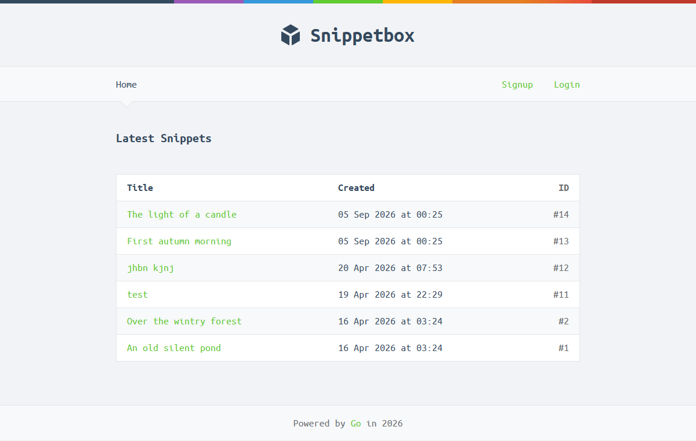
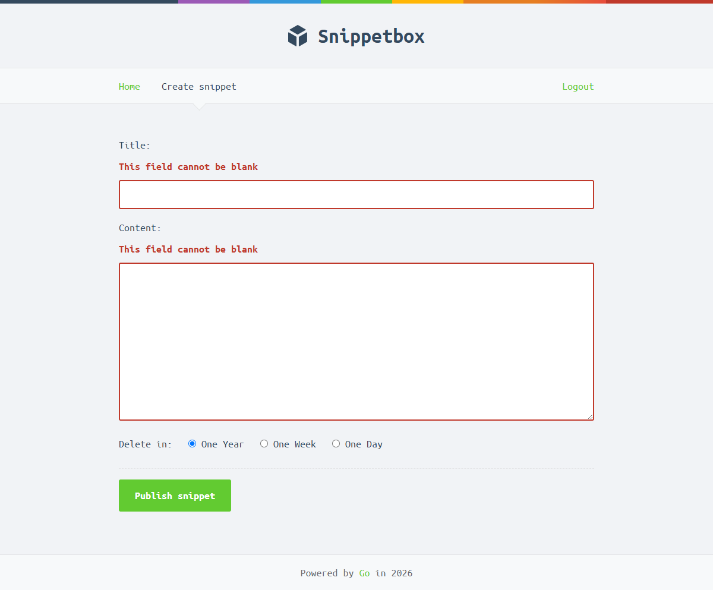
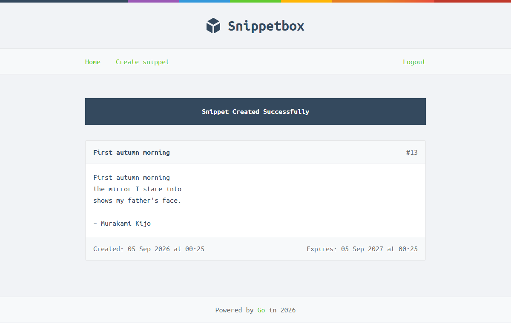
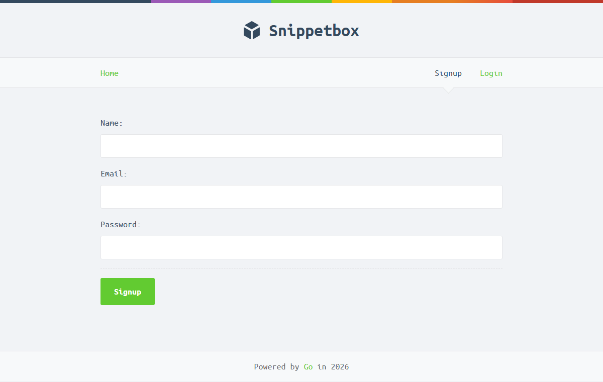

# Snippetbox

Go web app from Let's Go by Alex Edwards. Let's you put in some text enter a date it expires and you can share the link.

This was a Go learning exercise before I built anything real with Go. As it is the age of AI, I feel I am obligated to write let you know that every line of code here was written by hand! Chapter notes are in: notes/letsgo/. I wrote these in my own words from my understanding of each section, then went back through them at the end to make sure I actually understood everything I'd built.

- Routing with the stdlib mux, method based and wildcard routes
- MySQL through `database/sql`, models own all the DB access
- html/template with a template cache, static files embedded in the binary
- Form parsing, decoding and validation
- Sessions with scs, signup and login with bcrypt
- CSRF protection (nosurf), TLS, secure headers, structured logging
- Middleware chains with alice
- Unit and integration tests, with mocks for the models

## Screenshots

Home

Create a snippet,

View a snippet

Signup

